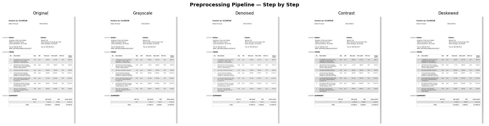

# OCR Document Pipeline

Extract structured data from invoices and documents using computer vision and OCR.



---

## What It Does

Takes a raw invoice image or PDF → preprocesses it → extracts text via Tesseract OCR → parses structured fields (date, address, products, prices).

```
Input (image/PDF) → Preprocess → OCR → Postprocess → Structured JSON
```

---

## Project Structure

```
ocr-document-pipeline/
├── src/
│   ├── preprocessor.py      # Image cleaning pipeline
│   ├── ocr_engine.py        # Tesseract OCR wrapper
│   ├── postprocessor.py     # Regex-based field extraction
│   └── main.py              # Entry point
├── notebooks/
│   └── ocr_experiments.ipynb  # Visual walkthrough
├── data/
│   └── sample_images/       # Test invoices
└── demo/
    └── preprocessing_steps.png
```

---

## Setup

**System dependencies:**
```bash
sudo apt-get install -y tesseract-ocr poppler-utils
```

**Python dependencies:**
```bash
pip install -r requirements.txt
```

---

## Usage

```bash
# Run on an image
python src/main.py data/sample_images/invoice.jpg

# Run on a PDF
python src/main.py data/sample_images/invoice.pdf
```

**Output:**
```json
{
  "date": "04/13/2013",
  "address": "Daniellefurt, IN 57228",
  "products": [["1", "CLEARANCE Fast Dell Desktop"], ["2", "HP T520 Thin Client Computer"]],
  "descriptions": ["Fast Dell Desktop Computer", "Thin Client Computer AMD"],
  "prices": ["209,00", "627,00", "689,70"]
}
```

---

## Pipeline Stages

**1. Preprocessing (`preprocessor.py`)**
- Grayscale conversion
- Median blur for noise removal
- CLAHE for contrast normalization (handles uneven lighting in phone-clicked docs)
- Deskew using `deskew` library

**2. OCR Engine (`ocr_engine.py`)**
- `image_to_text` — plain text extraction using PSM 6
- `image_to_data` — structured output with confidence scores (filtered > 60)
- `pdf_to_text` — converts PDF pages via `pdf2image` then runs OCR per page

**3. Postprocessing (`postprocessor.py`)**
- `clean_text` — removes OCR artifacts, normalizes whitespace
- `extract_date` — matches DD/MM/YYYY, MM-DD-YYYY, and Month DD YYYY formats
- `extract_address` — anchors on City, ST ZIP pattern
- `extract_product_names` — matches numbered line items
- `extract_prices` — handles both `.` and `,` decimal separators (EU format)

---

## Key Learnings

- Preprocessing order matters — CLAHE after denoising, not before
- `clean_text` must preserve `/` or date regex breaks
- European invoices use `,` as decimal separator — regex needs `[.,]` not `\.`
- Tesseract PSM 6 works best for uniform invoice layouts
- Regex alone cannot distinguish quantities from prices — layout-aware ML (LayoutLM) is the next step

---

## Requirements

```
opencv-python-headless
Pillow
deskew
pytesseract
pdf2image
pandas
matplotlib
imageio
```

